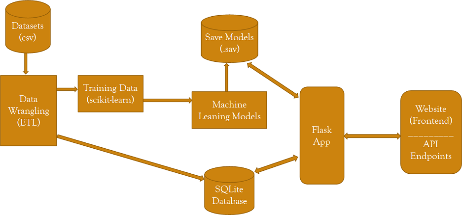

# Coffee-Analysis-and-Predictions

Coffee Production, Consumption and Quality Analysis

## 📝 Table of Contents

- [About](#about)
- [Getting Started](#getting_started)
- [Visualizations](#visualizations)
- [Acknowledgements](#acknowledgement)

## 🧐 About 
**Project Workflow:**

## 🏁 Getting Started 

**Questions to Answer:**  
1.	From the Coffee's quality factors can we predict the Coffee bean Species, Processing Method used and Altitude, Country or Region of Origin?
2.	Which Species of Coffee is produced more?
3.	Which all are the major Coffee Producing countries?
4.	Which Countries are the major importers of Coffee?
5.  Is Coffee Beans or Roast and Ground or Soluble(Instant) Coffee Exported more by the Countries producing Coffee?

## ✍️ Visualizations 

* World map with 2020 population of Countries. 

* Top 10 Countries & Top 10 cities in 2020. 

* World map with 2019 population density of Countries. 

* Top 10 Countries vs Rest of the World Population ratio in 2020. 

* Australia population actual & prediction. 

* Australia sex at birth ratio. 

* Australia birth rate. 

* Australia death rate. 

* Countries population actuals & prediction. 

* Cities population in 2019 & 2020. 

* API data. 

## 🎉 Acknowledgements 
- UWA Data Analytics Bootcamp
- International Coffee Organization: http://www.ico.org
- Kaggle, USDA_Coffee_Data_06_2020: https://www.kaggle.com/michaellight/usda-coffee-data-06-2020
- Kaggle, Coffee Quality database from CQI: https://www.kaggle.com/volpatto/coffee-quality-database-from-cqi
- Rest Countries API: https://restcountries.eu/rest/v2

