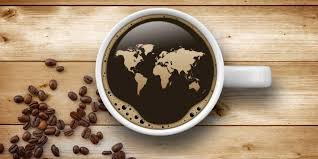
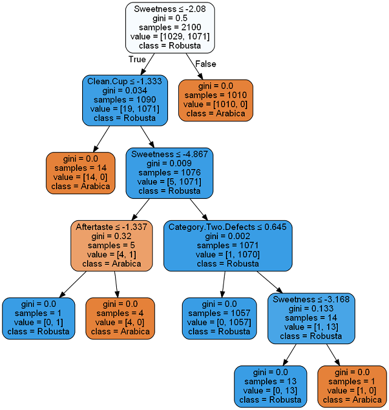

# Coffee-Analysis-and-Predictions

 
Coffee Production, Consumption and Quality Analysis

## 📝 Table of Contents

- [Getting Started](#getting_started)
- [Description](#description)
- [Visualizations](#visualizations)
- [Acknowledgements](#acknowledgement)

## 🏁 Getting Started 

**Questions to Answer:**  
1.	From the Coffee's quality factors can we predict the Coffee bean Species, Processing Method used and Altitude, Country or Region of Origin?
2.	Which Species of Coffee is produced more?
3.	Which all are the major Coffee Producing countries?
4.	Which Countries are the major importers of Coffee?
5.  Is Coffee Beans or Roast and Ground or Soluble(Instant) Coffee Exported more by the Countries producing Coffee?

## 🧐 Description 
**Project Workflow:**

 

**Machine Learning:**

Decision Tree Output of the Machine Learning Model For Predicting the Coffee Species from the Coffee Quality Factors with 99% accuracy.

## ✍️ Visualizations 

* 2020 Major contries producing Coffee.  

* 2020 Mojor Importers of Coffee.  

* Predicting Bean metadata from Coffee Quality.  

* Individual Countries Historical data.  

* API Documentation.  

## 🎉 Acknowledgements 
- UWA Data Analytics Bootcamp
- International Coffee Organization: http://www.ico.org
- Kaggle, USDA_Coffee_Data_06_2020: https://www.kaggle.com/michaellight/usda-coffee-data-06-2020
- Kaggle, Coffee Quality database from CQI: https://www.kaggle.com/volpatto/coffee-quality-database-from-cqi
- Rest Countries API: https://restcountries.eu/rest/v2

